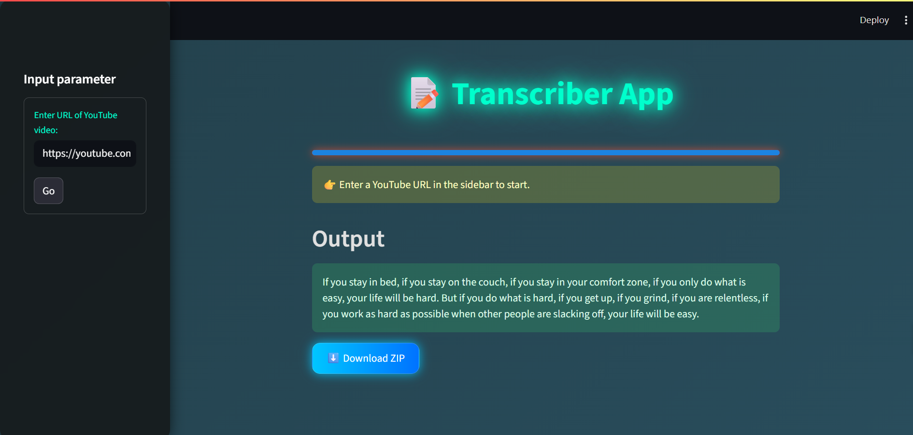

# 🎙️ Transcriber App  

A modern and stylish **audio & video transcription tool** built with **Python** and **Streamlit**.  
This app lets you download audio from YouTube or upload your own files, and then generates accurate **transcripts & subtitles** in `.txt` and `.srt` formats.  

---
## 📸 App Preview  

<p align="center">
  
</p>


## ✨ Features  

- 🎥 **YouTube Downloader** – extract audio from YouTube videos and shorts  
- 🎧 **Audio Upload** – upload `.mp3` or `.wav` files  
- 📝 **Transcription** – generate clean transcripts from speech  
- ⏱️ **Subtitle Export** – save transcripts as `.srt` or `.txt`  
- 🎨 **Modern Dark UI** – custom CSS styling for Streamlit  
- ⚡ **Lightweight** – no complex setup, runs locally in your browser  

---

## 🚀 Getting Started  

Follow these steps to set up and run the project locally:  

### 1️⃣ Clone the repository  
```bash
git clone https://github.com/Harshit4813/Transcriber-App.git
cd Transcriber-App
```

## ⚙️ Setup & Run  


## 2️⃣ Create a virtual environment
```bash
python -m venv .venv
```
## 3️⃣ Activate the environment

## ▶ Windows (PowerShell)
```
.venv\Scripts\activate
```
## ▶ Linux / macOS
```
source .venv/bin/activate
```
## 4️⃣ Install dependencies
```
pip install -r requirements.txt
```

## 5️⃣ Run the app
```
streamlit run app.py
```

### 👉 Now open http://localhost:8501 in your browser 🎉

## 📂 Project Structure  

- 📜 **app.py** – Main Streamlit app  
- 🧠 **transcriber.py** – Core transcription logic  
- 📦 **requirements.txt** – Dependencies  
- 📘 **README.md** – Project documentation  
- 🎨 **.streamlit/** – Streamlit configuration (custom CSS)  


## 🛠️ Tech Stack  

- 🐍 **Python 3.10+** – Core programming language  
- 🎨 **Streamlit** – Modern UI framework for interactive web apps  
- 🎵 **yt-dlp** – Download & process audio from YouTube  
- 🗣️ **Whisper / Speech Recognition** – AI-powered transcription engine  

# 🎯 Future Roadmap  

- 🌍 Multi-language transcription support  
- 📝 Speaker diarization (who spoke when)  
- ☁️ Deploy on **Streamlit Cloud / Hugging Face**  
- 📊 Interactive transcript editing inside the app  


## 🤝 Contributing  

Contributions are welcome!  
Feel free to **fork** this repo and submit a **pull request** with your improvements. 🚀  


## 📜 License  

This project is licensed under the **MIT License** – free to use & modify.  


## ⭐ Support  

If you like this project, don’t forget to **star ⭐ the repo** on GitHub!  
Your support helps keep the project growing. 💡  